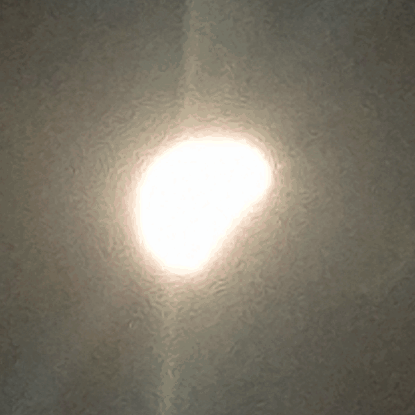

# Eclipse loop

Sixteen hand-held phone shots of the partial solar eclipse of **12 August 2026**,
19:04:58–19:17:33 (Galaxy S24+, 23mm equivalent), turned into a centred square
looping GIF.



Two outputs:

| file | frames | note |
| --- | --- | --- |
| `eclipse-loop.gif` | 16 | straight chronological run; snaps back at the end |
| `eclipse-loop-boomerang.gif` | 30 | plays forwards then backwards, so it loops seamlessly |

Both are 600×600, 150 ms per frame, looping forever.

## How the sun gets centred

Centring on the brightest blob doesn't work here. The disc is blown out and its
glow is lopsided — it spills towards whichever limb is still lit — so a
brightness centroid slides around as the moon eats into the sun, and the loop
wobbles.

Instead the script fits a circle to the sun's *limb*:

1. Threshold the saturated disc (pixels ≥ 250).
2. Take the outline of that region.
3. Fit a least-squares circle, then re-fit a few times, dropping points whose
   residual is far off the arc.

The moon's edge is a chord rather than an arc, and the lens-flare spikes are
outliers, so both fall out of the fit within a couple of passes and what's left
is the solar limb. That lands the centre within about a pixel on every frame
(measured by re-fitting the finished crops).

Two other things the frames needed first:

- **Orientation.** Fifteen shots carry EXIF orientation 6; one was already
  upright. Without applying the flag, that odd frame comes out rotated 90° from
  the rest.
- **Pixel scale.** That same frame was saved at 75.2% of the others' resolution
  at an identical focal length, so its sun is proportionally smaller in pixels.
  Every frame is resampled to a common long edge, which puts them all on one
  angular scale.

The disc still pulses slightly across the loop. That's real: the earlier, less
cloud-covered frames are more blown out, so the halo blooms wider. It's exposure,
not geometry, so it's left alone.

Dithering is deliberately off. The frames carry enough sensor grain to break up
the halo gradients by themselves, and Floyd–Steinberg on top both raised the
error against the source frames and grew the file by ~17%.

## Usage

```sh
pip install pillow numpy
python3 make_loop.py /path/to/photos -o .
```

Flags: `--size` (GIF edge, default 600), `--crop` (square pulled from the
original around the sun, default 950 px at the 4000 px baseline — smaller crops
in tighter), `--delay` (ms per frame, default 150).

The source JPEGs (~24 MB) aren't in the repo.
