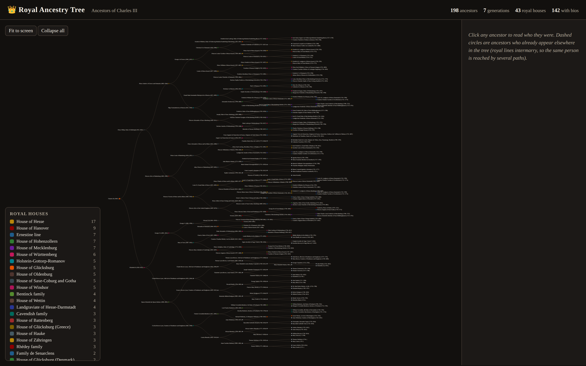

# 👑 Royal Ancestry Tree

Climb the full genealogy tree of a person and watch it fan out into the royal
houses of Europe. Every ancestor is a coloured node (one colour per royal
house), and clicking anyone opens a one-paragraph biography, portrait, and dates
pulled straight from Wikipedia.

The spark for this was a FamilySearch pedigree
([98R9-WVR](https://www.familysearch.org/en/tree/pedigree/landscape/98R9-WVR))
that was *expected to include several royal branches*. It does — 43 of them, in
the default demo.



```bash
$ python3 build_tree.py                 # default demo: King Charles III, 7 generations
$ open index.html                       # macOS
$ xdg-open index.html                   # Linux
```

## Where the tree comes from

FamilySearch's Family Tree API sits behind an OAuth login, so a private person
like `98R9-WVR` **cannot be fetched anonymously** — the public page only serves a
"please log in" shell. So this project climbs the *open* genealogy graph instead,
and gives you two honest ways in:

* **Wikidata** (default, zero setup). We walk `P22` (father) and `P25` (mother)
  up the tree one generation at a time with SPARQL, collecting names, dates,
  birthplaces, portraits (`P18`) and — the star of the show — the noble house
  `P53`. Royalty is superbly covered, which is exactly why the royal branches
  light up. Point it at anyone:

  ```bash
  $ python3 build_tree.py --wikidata Q9439 -g 8   # Queen Victoria, 8 generations
  $ python3 build_tree.py --wikidata Q150726       # Charles II of Spain (Habsburg inbreeding, visualised)
  ```

* **Your own FamilySearch tree** (for `98R9-WVR` itself). Log in to FamilySearch,
  export your tree to a GEDCOM file, and feed it straight in — the same
  enrichment and renderer draw it:

  ```bash
  $ python3 build_tree.py --gedcom mytree.ged --root 98R9-WVR
  ```

  `gedcom.py` is a small, forgiving GEDCOM 5.5 reader. It maps every individual
  to the same record shape the Wikidata crawler produces, so Wikipedia
  enrichment and royal-house colouring work on your export too. (GEDCOM files are
  `.gitignore`d — your family stays yours.)

## Enrichment

Every ancestor with an English Wikipedia article gets a biography and thumbnail
from the [Wikipedia REST summary API](https://en.wikipedia.org/api/rest_v1/),
cached under `data/wikipedia_cache.json` so re-runs are instant and polite to the
servers.

## The app

`index.html` is a **self-contained** interactive tree (D3 is inlined, ~440 KB,
no build step, no server). Open the file and:

* **Colour = royal house.** The legend ranks houses by how many of your ancestors
  belonged to each. Click a house to spotlight it.
* **Click an ancestor** for their Wikipedia bio, portrait, dates, birthplace, and
  house tags in the side panel.
* **Dashed circles** are ancestors who already appear elsewhere in the tree.
  Royal lines intermarry relentlessly (*pedigree collapse*), so the same person
  is reached by several paths — we draw them once in full, then as a light
  "see above" leaf so the picture stays finite and honest.
* **Fit to screen / Collapse all** to navigate; scroll to zoom, drag to pan.

## How it works

* `build_tree.py` — pure standard library. BFS ancestry crawl (one SPARQL query
  per generation), Wikipedia enrichment with an on-disk cache, royal-house colour
  assignment, pedigree-collapse-aware hierarchy, and a self-contained HTML
  renderer. Run `python3 build_tree.py --offline` to rebuild `index.html` from the
  cached `data/tree.json` with no network at all.
* `gedcom.py` — the FamilySearch bridge: a minimal GEDCOM reader.
* `data/` — the cached crawl (`tree.json`) and Wikipedia snapshots. Committed so
  the shipped `index.html` is reproducible offline.

## Default demo: the ancestors of Charles III

| | |
|---|---|
| Ancestors | **198** across 7 generations |
| Royal houses | **43** |
| Biographies matched | **142** |

Top branches: House of Hesse (17), House of Hanover (9), the Ernestine line (7),
Hohenzollern (7), Mecklenburg (7), Württemberg (6), Holstein-Gottorp-Romanov (5),
Glücksburg (5), Oldenburg (5), Saxe-Coburg and Gotha (5)…

> Note: building the tree needs internet (Wikidata + Wikipedia); viewing the
> generated `index.html` does **not** — the data and D3 are baked in. Portrait
> thumbnails are the only thing loaded live from Wikimedia when you open a bio.
